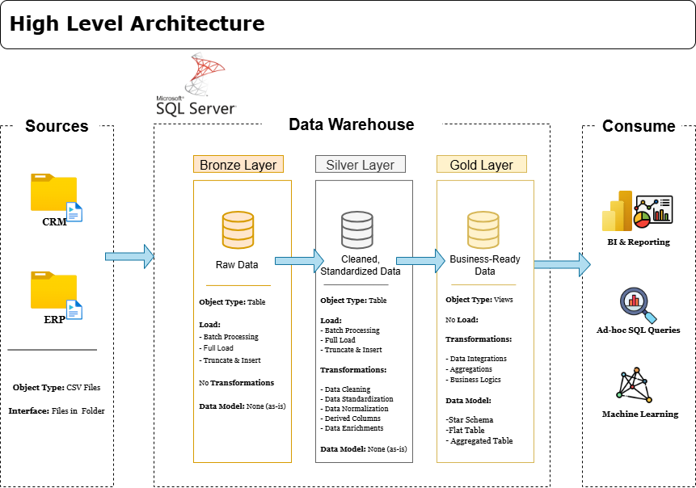

# SQL Data Warehouse Project

---

## Project Overview

This project demonstrates the design and implementation of a modern SQL Server data warehouse using the Medallion Architecture (Bronze, Silver, and Gold layers).

The solution consolidates data from multiple source systems, applies data quality transformations, and delivers a business-ready analytical model optimized for reporting and decision-making.

The project showcases practical applications of:

* Data Warehousing
* ETL Development
* Data Modeling
* Data Quality Validation
* SQL Development
* Business Intelligence Foundations

---

## Data Architecture

The warehouse follows the Medallion Architecture approach consisting of Bronze, Silver, and Gold layers.

<p align="center">
  
</p>

<p align="center">
  <em>Figure 1: Data Warehouse Architecture</em>
</p>

### Bronze Layer: Stores raw source data exactly as received from the source systems.

### Silver Layer: Stores cleaned, standardized, and validated data.

### Gold Layer: Stores business-ready datasets optimized for analytical reporting.

---

## Project Objectives

The primary objectives of this project were:

* Build a scalable SQL Server data warehouse
* Implement a multi-layer Medallion Architecture
* Develop ETL processes for data ingestion and transformation
* Create a dimensional data model for analytics
* Improve data quality and consistency
* Enable business reporting and analytical workloads

---

## Technologies Used

* SQL Server Express
* SQL Server Management Studio (SSMS)
* Git & GitHub
* Draw.io

---

## Repository Structure

```text
01_data_warehouse/
│
├── datasets/
│   └── Source CSV files
│
├── docs/
│   ├── Data Architecture
│   ├── Data Flow Diagrams
│   ├── Data Models
│   └── Documentation
│
├── scripts/
│   ├── bronze/
│   │   └── Raw Data Load Scripts
│   │
│   ├── silver/
│   │   └── Data Transformation Scripts
│   │
│   └── gold/
│       └── Analytical Data Model Scripts
│
├── tests/
│   └── Data Quality Validation Scripts
│
└── README.md
```

---

## Data Modeling Approach

The Gold Layer follows a dimensional modeling approach consisting of:

### Dimension Tables

* Customers
* Products

### Fact Tables

* Sales

This structure supports efficient analytical queries and reporting workloads.

---

## Key SQL Concepts Applied

Throughout the project, the following SQL techniques were utilized:

* Joins
* Common Table Expressions (CTEs)
* Views
* Data Transformation
* Data Cleansing
* Aggregations
* Constraints
* Data Quality Checks

---

## Business Value

The final warehouse provides a reliable analytical foundation for:

* Customer Analysis
* Product Performance Analysis
* Revenue Reporting
* Sales Trend Analysis
* Business Intelligence Reporting

---

## Future Enhancements

Potential future improvements include:

* Incremental data loading
* Historical tracking (SCD implementation)
* Automation of ETL workflows
* Dashboard integration using Power BI
* Advanced analytical models
  
---

* ## Next Steps

The analytical data generated in this project will be used in:

- Project 02: Exploratory Data Analysis
- Project 03: Advanced Analytics

---
